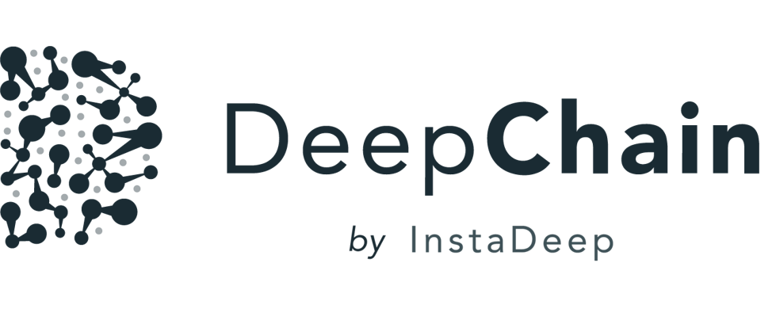
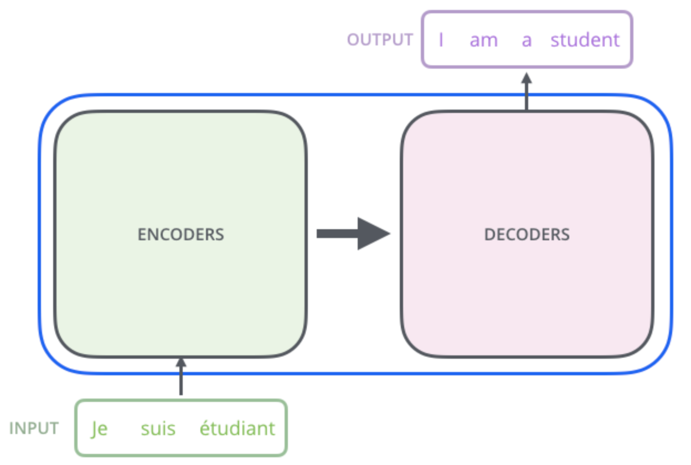
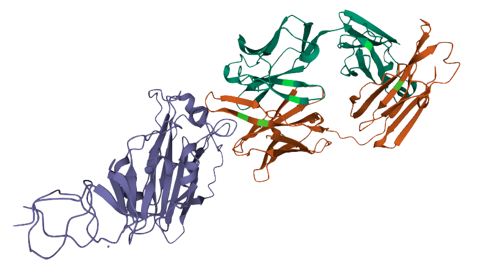
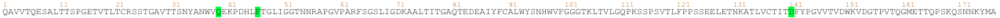

<p align="center">
  
</p>


[](https://opensource.org/licenses/Apache-2.0)
[](https://www.python.org/downloads/release/python-360/)
[](https://github.com/psf/black)

[](https://bio-transformers.readthedocs.io/en/latest/?badge=latest)
[](https://codecov.io/gh/delfosseaurelien/bio-transformers)

<details><summary>Table of contents</summary>

- [Description](#bio-transformers)
- [Installation](#Installation)
- [Usage](#usage)
  - [Quick Start](#quickstart)
  - [Compute embeddings](#embeddings)
  - [Pseudo-Loglikelihood](#pseudo-loglikelihood)
- [Roadmap](#roadmap)
- [Citations](#citations)
- [License](#license)
</details>


# 🧬 Bio-transformers

## Overview

`bio-transformers` is a python wrapper on top of the **ESM/Protbert** models, which are **Transformers protein language models**, trained on millions of proteins and used to predict embeddings. We leverage these state of the art models in a simple interface with practical functionnalities.

This package provides a unified interface to use all these models - which we call `backends`. For instance you'll be able to compute natural amino-acids probabilities, embeddings or easily finetune your model on multiple-GPUs with `Ray`.

📕 Please refer to the documentation [here](https://bio-transformers.readthedocs.io/en/latest/).


 You can find the original repositories for the models here :
 - [ESM](https://github.com/facebookresearch/esm/)
 - [Protbert](https://github.com/agemagician/ProtTrans)

## What is a transformer?
`Transformers` are an AI language model that has had huge impact in speech recognition and automated chatbots and has now been pointed out as a revolutionising technique to understand the language of proteins, offering an innovative approach to study and design proteins. They have been introduced in [Attention is all you need](https://arxiv.org/abs/1706.03762) paper. This [blog post](https://jalammar.github.io/illustrated-transformer/) can give you an in depth view of the transformer architecture and the mathematics behind.


When trained with a large database on a particular language, such as English, the model learns about the words and grammar and can generate complete sentences when prompted. Let’s look at the following example:

<p align="center">
  
</p>

 ### Why transformers for protein ?
 Proteins are molecules that perform critical functions in all living beings. It consists of one or more strings of amino acids. There are only 20 different amino acids and the different combinations of them have resulted in thousands of functional proteins in humans. If we consider amino acids as words that constitute proteins, which are the sentences, then we could use transformers to understand the language of proteins. When trained with the billions of protein sequences identified so far across multiple species, a transformer is capable of understanding what sequences of amino acids make sense from a language perspective and can propose new combinations.

<p align="center">
  
</p>

<p align="center">
  
</p>

Querying a transformer trained in the language of proteins on a particular sequence provides a wealth of information about the protein. As seen in the above example, the transformer can tell you which amino acids might be key and need to be present at the protein of interest from a language perspective. This information is of particular interest when trying to understand amino acid regions that might be essential to protein function or stability.

## Getting started

## Installation
It is recommended to work with conda environments in order to manage the specific dependencies of this package.
The `bio-transformers` package can be found on [pypi](https://pypi.org/project/bio-transformers/).

Please note that you are suppose to have a correct cuda/torch installation before installing this library.


### Work with conda environment

1. Install [Miniconda](https://docs.conda.io/en/latest/miniconda.html) or [Anaconda](https://www.anaconda.com/products/individual)

2. Create a virtual environment and activate it.

```bash
  conda create --name bio-transformers python=3.7 -y && conda activate bio-transformers
```

3. Install the package in environment.

```bash
  pip install bio-transformers
```

### Environment for developing

Conda:

1. Clone this git repo via HTTPS or SSH:

 ```bash
 git clone https://github.com/DeepChainBio/bio-transformers
 cd bio-transformers
 ```

2. Create developement environment based on the yaml file.

```bash
conda env create -f environment_dev.yaml
conda activate bio-transformers-dev
```

3. Install package and pre-commit hooks.

```
pip install -e .
pre-commit install
```

Docker:

You can directly use a docker image for using bio-transformers or for development. The image is based on cuda11.1, be sure to use it on GPU.

1. Build the image:

```
docker build --tag instadeep/biotransformers-dev .
```

2. Run interactively with GPUs:

```
docker run --rm -it --gpus all -v  /home/bio-transformers:/app/bio-transformers instadeep/biotransformers-dev /bin/bash
```

# Usage

## Quick start

The main class ```BioTranformers``` allows developers to use Protbert and ESM backends

```python
> from biotransformers import BioTransformers
> BioTransformers.list_backend()
```

```python
>>
Use backend in this list :

    *   esm1_t34_670M_UR100
    *   esm1_t6_43M_UR50S
    *   esm1b_t33_650M_UR50S
    *   esm_msa1_t12_100M_UR50S
    *   protbert
    *   protbert_bfd

```

## Embeddings

The embedding of a an object is a representation of the object in a lower dimensional space. In this lower space, it is easier to manipulate, visualize, and apply mathematical functions on proteins' projection. Embeddings model will take a sequence of amino acids in input (string) and return a vector of lower dimension.

You can choose a backend and pass a list of sequences of Amino acids to compute the embeddings.
By default, the ```compute_embeddings``` function returns the ```<CLS>``` token embeddings.
You can add a ```pool_mode``` in addition, so you can compute the mean of the tokens embeddings.

```python
from biotransformers import BioTransformers

sequences = [
        "MKTVRQERLKSIVRILERSKEPVSGAQLAEELSVSRQVIVQDIAYLRSLGYNIVATPRGYVLAGG",
        "KALTARQQEVFDLIRDHISQTGMPPTRAEIAQRLGFRSPNAAEEHLKALARKGVIEIVSGASRGIRLLQEE",
    ]

bio_trans = BioTransformers(backend="protbert")
embeddings = bio_trans.compute_embeddings(sequences, pool_mode=('cls','mean'),batch_size=2)

cls_emb = embeddings['cls']
mean_emb = embeddings['mean']
```

### Multi-gpu

If you have access to multiple GPUs, you can specify the ```num_gpus``` option to speed-up the inference. Please refer to this [section](https://bio-transformers.readthedocs.io/en/develop/documentation/multi_gpus.html) to have a full understanding.

This option relies on  `Ray` since version 0.0.11 (```torch.nn.DataParallel``` and `multi_gpu` option deprecated.)

```python
import ray

ray.init()
bio_trans = BioTransformers(backend="protbert",num_gpus=2)
embeddings = bio_trans.compute_embeddings(sequences, pool_mode=('cls','mean'), batch_size=2)
```

## Pseudo-Loglikelihood

The protein loglikelihood is a metric that estimates the joint probability of observing a given sequence of amino acids. The idea behind such an estimator is to approximate the probability that a mutated protein will be “natural”, and can effectively be produced by a cell.

These metrics rely on transformers language models. These models are trained to predict a “masked” amino acid in a sequence. As a consequence, they can provide us with an estimate of the probability of observing an amino acid given the “context” (the surrounding amino acids).  By multiplying individual probabilities computed for a given amino-acid given its context, we obtain a pseudo-likelihood, which can be a candidate estimator to approximate sequence stability.

```python
from biotransformers import BioTransformers
import ray

sequences = [
        "MKTVRQERLKSIVRILERSKEPVSGAQLAEELSVSRQVIVQDIAYLRSLGYNIVATPRGYVLAGG",
        "KALTARQQEVFDLIRDHISQTGMPPTRAEIAQRLGFRSPNAAEEHLKALARKGVIEIVSGASRGIRLLQEE",
    ]

bio_trans = BioTransformers(backend="protbert",num_gpus=1)
loglikelihood = bio_trans.compute_loglikelihood(sequences)
```

## Finetune pre-trained transformers on your dataset

You can use the `finetune` function to finetune your backend on your dataset. The model is automatically scaled on the available GPUs. More information on the [documentation](https://bio-transformers.readthedocs.io/en/main/getting_started/quick_start.html#display-available-backend)

```python
import biodatasets
import numpy as np
from biotransformers import BioTransformers
import ray

data = biodatasets.load_dataset("swissProt")
X, y = data.to_npy_arrays(input_names=["sequence"])
X = X[0]

# Train on small sequences
length = np.array(list(map(len, X))) < 200
train_seq = X[length][:15000]

ray.init()
bio_trans = BioTransformers("esm1_t6_43M_UR50S", num_gpus=2)

bio_trans.finetune(
    train_seq,
    lr=1.0e-5,
    warmup_init_lr=1e-7,
    toks_per_batch=2000,
    epochs=20,
    batch_size=16,
    acc_batch_size=256,
    warmup_updates=1024,
    accelerator="ddp",
    checkpoint=None,
    save_last_checkpoint=False,
)
```

# Roadmap:

- support MSA transformers

# ✏️  Citations

Here some papers on interest on the subject.

The excellent ProtBert work can be found at [(biorxiv preprint)](https://www.biorxiv.org/content/10.1101/2020.07.12.199554v3.full.pdf):

```bibtex
@article{protTrans2021,
  author={Ahmed Elnaggar and Michael Heinzinger, Christian Dallago1,Ghalia Rihawi, Yu Wang, Llion Jones, Tom Gibbs, Tamas Feher, Christoph Angerer,Debsindhu Bhowmik and Burkhard Rost},
  title={ProtTrans: Towards Cracking the Language of Life’s Code Through Self-Supervised Deep Learning and High Performance Computing},
  year={2019},
  doi={10.1101/2020.07.12.199554},
  url={https://www.biorxiv.org/content/10.1101/2020.07.12.199554v3.full.pdf},
  journal={bioRxiv}
}
```

For the ESM model, see [(biorxiv preprint)](https://www.biorxiv.org/content/10.1101/622803v4):
```bibtex
@article{rives2019biological,
  author={Rives, Alexander and Meier, Joshua and Sercu, Tom and Goyal, Siddharth and Lin, Zeming and Liu, Jason and Guo, Demi and Ott, Myle and Zitnick, C. Lawrence and Ma, Jerry and Fergus, Rob},
  title={Biological Structure and Function Emerge from Scaling Unsupervised Learning to 250 Million Protein Sequences},
  year={2019},
  doi={10.1101/622803},
  url={https://www.biorxiv.org/content/10.1101/622803v4},
  journal={bioRxiv}
}
```

For the self-attention contact prediction, see [the following paper (biorxiv preprint)](https://www.biorxiv.org/content/10.1101/2020.12.15.422761v1):

```bibtex
@article{rao2020transformer,
  author = {Rao, Roshan M and Meier, Joshua and Sercu, Tom and Ovchinnikov, Sergey and Rives, Alexander},
  title={Transformer protein language models are unsupervised structure learners},
  year={2020},
  doi={10.1101/2020.12.15.422761},
  url={https://www.biorxiv.org/content/10.1101/2020.12.15.422761v1},
  journal={bioRxiv}
}
```

For the MSA Transformer, see [the following paper (biorxiv preprint)](https://doi.org/10.1101/2021.02.12.430858):

```bibtex
@article{rao2021msa,
  author = {Rao, Roshan and Liu, Jason and Verkuil, Robert and Meier, Joshua and Canny, John F. and Abbeel, Pieter and Sercu, Tom and Rives, Alexander},
  title={MSA Transformer},
  year={2021},
  doi={10.1101/2021.02.12.430858},
  url={https://www.biorxiv.org/content/10.1101/2021.02.12.430858v1},
  journal={bioRxiv}
}
```


# 📘 License

This source code is licensed under the **Apache 2** license found in the `LICENSE` file in the root directory.
