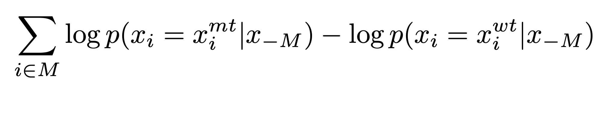

Mutation score
==============

To compute the ``mutation score``, for a given mutation we can consider the amino acid in the wildtype protein as a reference state, and compare the probability assigned to the mutated amino acid with the probability assigned to the wildtype.
In practice, at each mutated position, we introduce a mask token and record the model’s predicted probabilities of the tokens at that position. This metric is describe in the `paper <https://www.biorxiv.org/content/10.1101/2021.07.09.450648v1.full.pdf>`_

We call it the ``masked marginal probability``, which is described below:

compute_mutation_score function
-------------------------------

To compute this metric, we need to provide to things:

- **sequences**: a list of sequence to score

- **mutations**: a list of sequence' mutations. A sequence" mutations can be composed of multiple single mutations.

Example
-------

.. code-block:: python

    from biotransformers import BioTransformers

    sequences = ["MAPSRKFFVGGNWKMNVVCAPPTAYIDFARQKLDPKI",
                 "AVAAQNCYKVTNGAFTGEISPGMIKDCGATWVVLGH",
                 "GRKQSLGELIGTLNAAKVPADTE"]

    mutations = [["M1P","K6F","N12G"],["A4V"],["A15L","V18A"]]
    bio_trans.compute_mutation_score(sequences,mutations)

.. code-block:: bash

    >> [-4.07569046318531, -0.848480224609375, 0.4472615122795105]

To create a mutations list, you need to respect the mutations format above in the example:

- format : `Native_aaPositionMutated_aa`.

.. important:: Your position index for mutation must start at 1.
